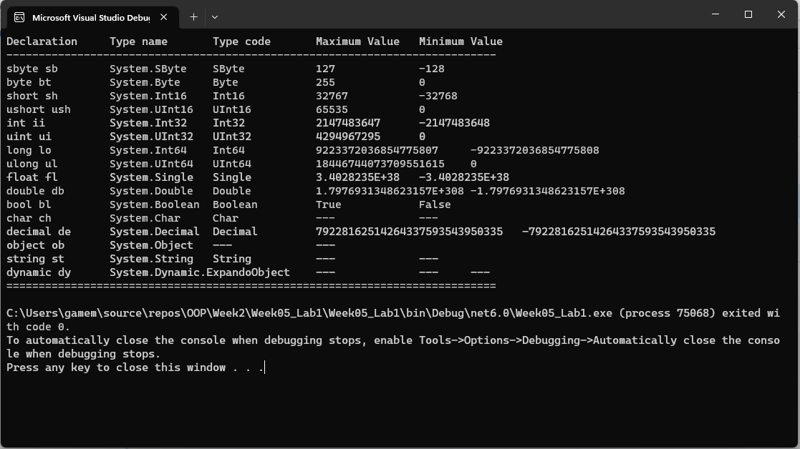

# การทดลองสัปดาห์ที่ 5.2 #
## แสดงรายละเอียดของ predefined type ในภาษา C#  ##


### Learning Outcome ###
1. นักศึกษารู้จัก predefined type และบอกได้ว่ามีอะไรบ้าง
2. นักศึกษาสามารถเขียนโปรแกรมเพื่อรายงานค่าเฉพาะตัวของ predefined type ได้

## แบบฝึกหัด ##

แก้ไขโค้ดตัวอย่าง ให้รายงานรายละเอียดของ predefine type ได้ครบถ้วน

Type ใดที่ไม่มี properties ที่กำหนดให้แสดงก็ให้เว้นไว้ หรือใช้การขีด (`-`)
```cs
sbyte sb = new sbyte();  // create new object
byte bt = new byte();
short sh = new short();
ushort ush = new ushort();
int ii = new int();
uint ui = new uint();
long lo = new long();
ulong ul = new ulong();
float fl = new float();
double db = new double();
bool bl = new bool();
char ch = new char();
decimal de = new decimal();

object ob = new object();
string st = new string("");
dynamic dy = new System.Dynamic.ExpandoObject();


Console.WriteLine($"Declaration\tType name\tType code\tMaximum Value\tMinimum Value");
Console.WriteLine($"----------------------------------------------------------------------------");
Console.WriteLine($"sbyte sb\t{sb.GetType()}\t{sb.GetTypeCode()}\t\t{sbyte.MaxValue}\t\t{sbyte.MinValue}");
Console.WriteLine($"byte bt\t\t{bt.GetType()}\t{bt.GetTypeCode()}\t\t{byte.MaxValue}\t\t{byte.MinValue}");
Console.WriteLine($"short sh\t{sh.GetType()}\t{sh.GetTypeCode()}\t\t{short.MaxValue}\t\t{short.MinValue}");
Console.WriteLine($"ushort ush\t{ush.GetType()}\t{ush.GetTypeCode()}\t\t{ushort.MaxValue}\t\t{ushort.MinValue}");
Console.WriteLine($"int ii\t\t{ii.GetType()}\t{ii.GetTypeCode()}\t\t{int.MaxValue}\t{int.MinValue} ");
Console.WriteLine($"uint ui\t\t{ui.GetType()}\t{ui.GetTypeCode()}\t\t{uint.MaxValue}\t{uint.MinValue}");
Console.WriteLine($"long lo\t\t{lo.GetType()}\t{lo.GetTypeCode()}\t\t{long.MaxValue}\t{long.MinValue}");
Console.WriteLine($"ulong ul\t{ul.GetType()}\t{ul.GetTypeCode()}\t\t{ulong.MaxValue}\t{ulong.MinValue}");
Console.WriteLine($"float fl\t{fl.GetType()}\t{fl.GetTypeCode()}\t\t{float.MaxValue}\t{float.MinValue}");
Console.WriteLine($"double db\t{db.GetType()}\t{db.GetTypeCode()}\t\t{double.MaxValue}\t{double.MinValue}");
Console.WriteLine($"bool bl\t\t{bl.GetType()}\t{bl.GetTypeCode()}\t\t{bool.TrueString}\t\t{bool.FalseString}");
Console.WriteLine($"char ch\t\t{ch.GetType()}\t{ch.GetTypeCode()}\t\t{"---"}\t\t{"---"}");
Console.WriteLine($"decimal de\t{de.GetType()}\t{de.GetTypeCode()}\t\t{decimal.MaxValue}\t{decimal.MinValue}");
Console.WriteLine($"object ob\t{ob.GetType()}\t{"---"}\t\t{"---"}\t{""}");
Console.WriteLine($"string st\t{st.GetType()}\t{st.GetTypeCode()}\t\t{"---"}\t\t{"---"} ");
Console.WriteLine($"dynamic dy\t{dy.GetType()}\t{"---"}\t\t{"---"}\t{"---"} ");

Console.WriteLine("============================================================================");
```



sbyte เลขจำนวนเต็ม 8 บิต <br>
byte เลขจำนวนเต็มบวกขนาด 8 บิต <br>
short เลขจำนวนเต็มขนาด 16 บิต <br>
ushort เลขจำนวนเต็มบวกขนาด 16 บิต <br>
int เลขจำนวนเต็มขนาด 32 บิต <br>
uint เลขจำนวนเต็มบวกขนาด 32 บิต <br>
long เลขจำนวนเต็มขนาด 64 บิต <br>
ulong เลขจำนวนเต็มบวกขนาด 64 บิต <br>
float เลขจำนวนจริงขนาด 32 บิต <br>
double เลขนจำนวนจริงขนาด 64 บิต <br>
bool มีค่า True และ False <br>
char เก็บตัวอักษร Unicode ขนาด 16 บิต <br>
decimal เลขขนาด 128 บิต <br>
object ป็นคลาสพื้นฐานสำหรับทุกประเภทใน C# และแทนตัวอ็อบเจกต์ที่อยู่ในหน่วยความจำ <br> 
string ใช้เก็บตัวอักษรหลายตัวหรือข้อความ <br>
dynamic ใช้การเรียกเมธอดแบบ dynamic dispatch ซึ่งช่วยให้คุณสามารถเรียกเมธอดและเข้าถึงคุณสมบัติแบบดัชนีด้วยตนเองในเวลารัน